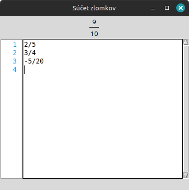

# Sčítač Zlomkov

Jednoduchý program na sčítanie zlomkov.



### Fičúry
- **Sčitanie a Odčítanie zlomkov**
- **Hlásenie chýb** vo formáte
- Po kliknutí na hlásenie chýb vás program **presunie na riadok s chybou**
- **"Drag and Drop"** - keď zoberiete textový súbor a presunieťe ho nad okno Sčítača zlomkov,
súbor sa otvorí v programe. To čo tam máte už zadané sa vymaže.

## Stiahnutie

Sčítač zlomkov môžete skompilovať podľa [inštrukcií nižšie](#kompilácia-windows) alebo ho stiahnuť [tu](https://github.com/TekMike365/ScitacZlomkov/releases).

## Development

### Nastavenie virtuálneho prostredia

1. Ak nemáte v pythone modul `venv` stiahnite ho pomocou

```sh
pip install venv
```

2. Vytvorte virtuálne prostredie

```sh
python3 -m venv .venv
```

2.1 aktivujte ho
```sh
source ./.venv/bin/activate  # Linux
```
```sh
.\.venv\Scripts\activate.bat  # Windows cmd
```
```sh
.\.venv\Scripts\Activate.PS1  # Windows PowerShell
```

> Deaktivovať virtuálne prostredie môžete s pomocou príkazu: `deactivate`

3. Nainštalujte vyžadované moduly

```sh
pip install -r requirements.txt
```

4. Spustite program :D

```sh
python scitac_zlomkov.py
```

### Kompilácia

Pre skompilovanie Sčítača Zlomkovov treba najprv nastaviť [virtuálne prostredie](#nastavenie-virtuálneho-prostredia).

```sh
pyinstaller -Fw scitac_zlomkov.py -n ScitacZlomkov
```

Skompilovaný program nájdete v priečinku `dist`.
